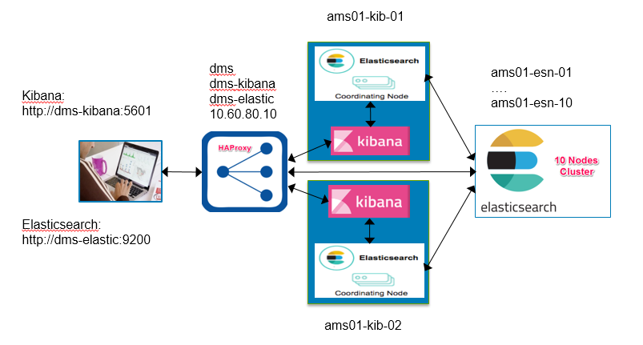
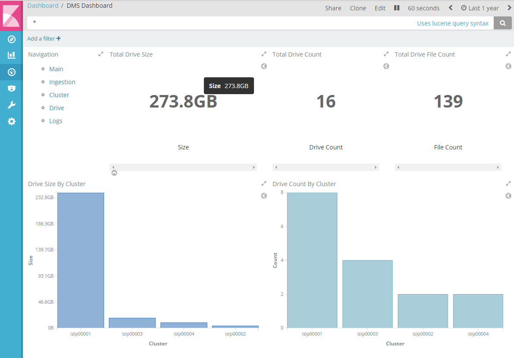
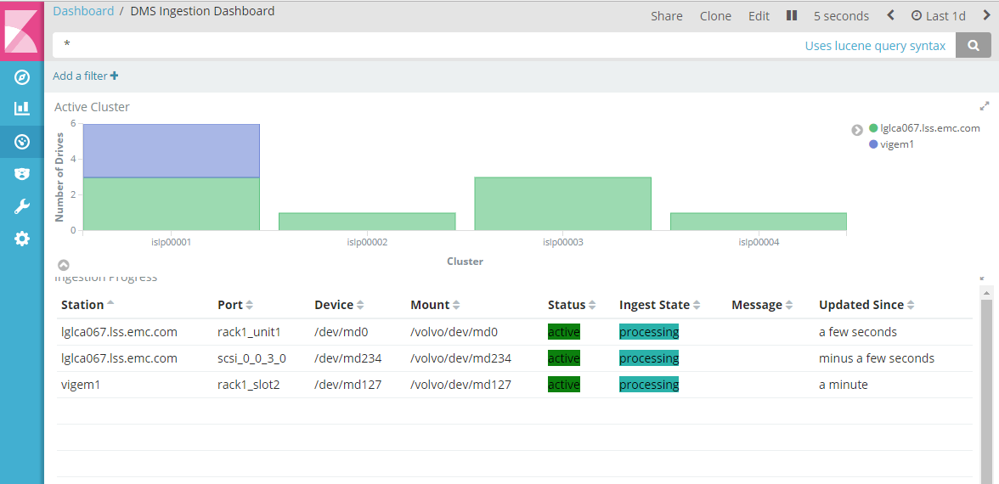
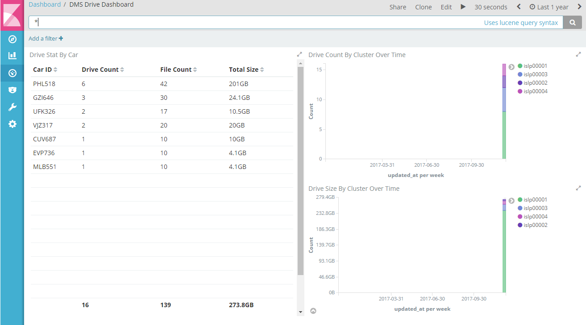
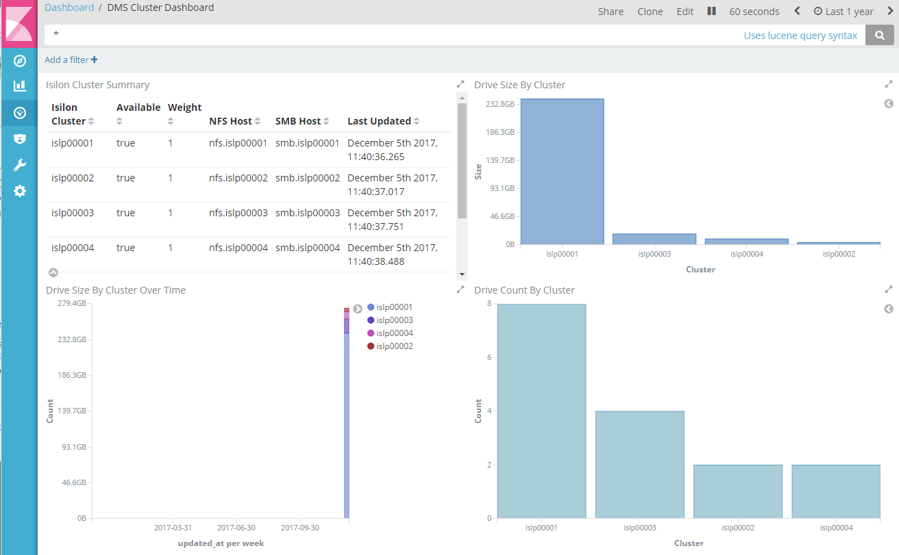
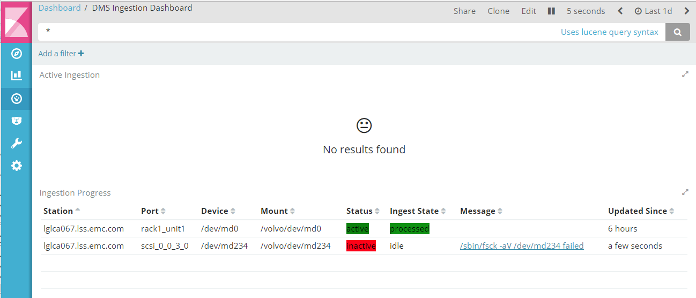
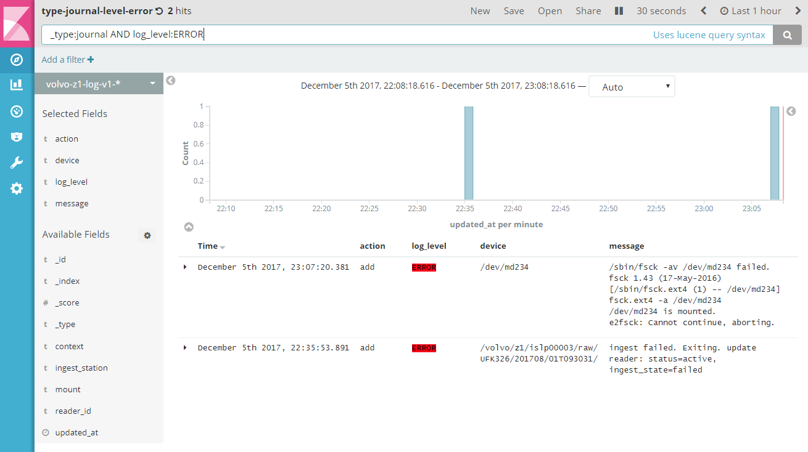
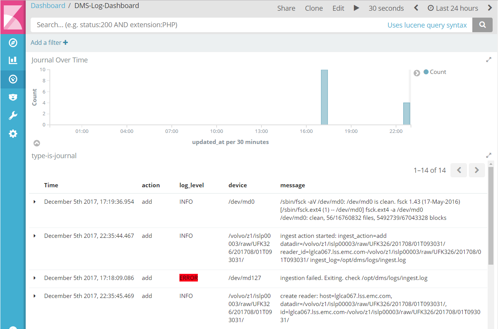
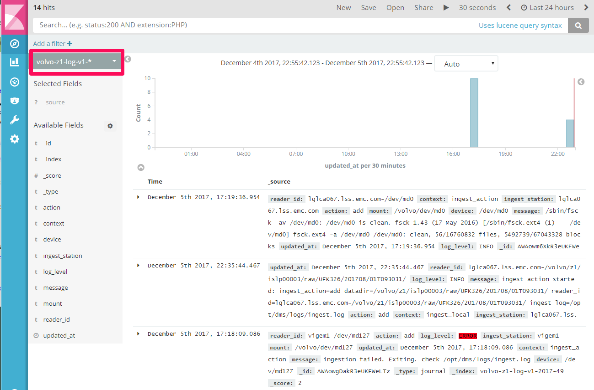

DMS Administration And Configuration Guide
==========================================

Administration and configuration guide for Data Management System.

Download DMS Software
---------------------

Download source code packages and documentations from https://github.com/EMCECS/volvo/releases.
Then extract them to a directory. In this document, it is assumed the code is extracted to ~/volvo-1.0.
Adjust accordingly if the version or working directory are different.

Ingestion Configuration
-----------------------

The ingestion configuration should have been installed at /opt/dms/conf/ingest.conf.
Configuration must be done on every ingest station.

In general the default values in the conf should work without any change except for the reader mapping. 

- Elasticsearch Login. Locate the **[elasticsearch]** section in ingest.conf and update user and password fields if needed.

- Reader Mappings. Locate the following lines in the **[station_config]** section::

    # mapping for readers. map disk path to their location on upload racks.
    # example output from ls -l /dev/disks/by-path
    # lrwxrwxrwx. 1 root root  9 Dec 15 18:27 pci-0000:81:00.0-sas-phy0-lun-0 -> ../../sdb
    # lrwxrwxrwx. 1 root root  9 Dec 15 18:27 pci-0000:81:00.0-sas-phy1-lun-0 -> ../../sdd
    # lrwxrwxrwx. 1 root root  9 Dec 15 18:27 pci-0000:81:00.0-sas-phy2-lun-0 -> ../../sdi
    # lrwxrwxrwx. 1 root root  9 Dec 15 18:27 pci-0000:81:00.0-sas-phy3-lun-0 -> ../../sdf
    # lrwxrwxrwx. 1 root root  9 Dec 15 18:26 pci-0000:81:00.0-sas-phy4-lun-0 -> ../../sde
    # lrwxrwxrwx. 1 root root  9 Dec 15 18:26 pci-0000:81:00.0-sas-phy5-lun-0 -> ../../sdc
    # lrwxrwxrwx. 1 root root  9 Dec 15 18:26 pci-0000:81:00.0-sas-phy6-lun-0 -> ../../sdh
    # lrwxrwxrwx. 1 root root  9 Dec 15 18:26 pci-0000:81:00.0-sas-phy7-lun-0 -> ../../sdg
    #
    # convert [:-.] in the path name to _ in the mapping below.
    pci_0000_81_00_0_sas_phy4_lun_0 = rack1_slot1
    pci_0000_81_00_0_sas_phy0_lun_0 = rack1_slot2

  And map the disk paths to the locations of the cartridge readers on the racks. The locations
  will show up on the DMS Ingestion Dashboard for operators to identify the cartridge readers. 
  To find out the mappings, insert a cartridge to readers one by one and then examine the the output 
  from command::

    $ ls -l /dev/disks/by-path

- Auto formatting of device::

    auto_format = False
    
  It is set to **False** by default. In initial stage of operations and testing, 
  it is recommended to keep it False given the lack of testing on real ingestion stations.
  The device can be formatted manually if needed. 

You can update the configuration file at any time. The changes will be automatically picked
up when next ingestion starts.

The ingestion logs go to /opt/dms/logs/ingest.log. A rotation policy should be set for the log file.

Elasticsearch and Kibana
------------------------

   Elasticsearch and Kibana Information

Kibana Configuration
~~~~~~~~~~~~~~~~~~~~

Add the following line to Kibana configuration file at /etc/kibana/kibana.yml on all the nodes running Kibana service

.. code-block:: console

    kibana.defaultAppId: "dashboard/DMS-Dashboard"

Then restart Kibana service on all Kibana nodes

.. code-block:: console

    systemctl restart kibana

Initialize Elasticsearch
~~~~~~~~~~~~~~~~~~~~~~~~

You should perform this step of configuration on a box with DMS Ingestion Component installed,
e.g., on a staging host or on an ingest station. You only need to run this once.

Elasticsearch initinization for DMS includes creating Isilon cluster configuration, loading templates and data mappings,
creating indices, loading kibana dashboards, etc.

Set The following environment variables. The default values are listed. You can skip setting the variables if the default
values are valid.

.. code-block:: console

    export ES_ENDPOINT=http://dms-elastic:9200
    export ES_USERNAME=elastic
    export ES_PASSWORD=changeme
    export NFS_PREFIX=nfs.islp0000
    export SMB_PREFIX=smb.islp0000

The NFS_PREFIX is used to construct Isilon NFS endpoints. For example, the endpoint
for cluster 1 would be nfs.islp00001. The SMB_PREFIX is used to construct Isilon SMB shares. For example, 
the SMB share access point for cluster 1 would be smb.islp00001.

To initialize Elasticsearch::

    $ cd ~/volvo-1.0/bootstrap/elastic/bin
    $ ./load.sh

Run the following command to examine the cluster configuration::

    $ dms_utils cluster_list

For a cluster, the output should look like the followings

.. code-block:: console

    {'available': True,
    'cluster_id': 'islp00004',
    'nfs_host': 'nfs.islp00004',
    'output_export': '/ifs/z1/islp00004/output',
    'output_mount': '/volvo/z1/islp00004/output',
    'output_share': '\\\\nfs.islp00004/ifs/z1/islp00004/output',
    'perm_export': '/ifs/z1/islp00004/perm',
    'perm_mount': '/volvo/z1/islp00004/perm',
    'perm_share': '\\\\nfs.islp00004/ifs/z1/islp00004/perm',
    'raw_export': '/ifs/z1/islp00004/raw',
    'raw_mount': '/volvo/z1/islp00004/raw',
    'raw_share': '\\\\nfs.islp00004/ifs/z1/islp00004/raw',
    'resim_export': '/ifs/z1/islp00004/resim',
    'resim_mount': '/volvo/z1/islp00004/resim',
    'resim_share': '\\\\nfs.islp00004/ifs/z1/islp00004/resim',
    'smb_host': 'smb.islp00004',
    'updated_at': datetime.datetime(2017, 11, 21, 18, 43, 18, 151652),
    'weight': 1}

If the cluster configurations do not reflect the configuration of the system, 
use **dms_utils** command to update/delete/create cluster configurations. For more details see::

    $ dms_utils --help

Use **dms_utils cluster_update** command to update the following fields of the cluster::

    weight
    available

- Set **available** of a cluster to **false** to temporarily disable the cluster from receiving any data.
- Set **weight** to a lower value than 1 to reduce the amount of data being directed a cluster.

DMS Dashboards
--------------

Point your browser to the following URL to access the DMS dashboards::

    http://dms-kibana:5601

The URL will direct you to the DMS main dashboard

DMS Main Dashboard
~~~~~~~~~~~~~~~~~~

The main dashboard shows the total number of drives and total size, and their distribution on the 
Isilon clusters in the last one year. By default, the dashboard refreshes every one minute. You can 
change the time range by clicking the "clock" icon on the top right of the screen.

There is a navigation pane on the top left. To open another dashboard,
right click on one of the links, then open in new tab or window 

   DMS Main Dashboard

DMS Ingestion Dashboard
~~~~~~~~~~~~~~~~~~~~~~~

To open the DMS Ingesttion dashboard, on the navigation pane of the main dashboard, 
right click the **Ingestion** link, then open in new tab or new window.

The chart on the top shows the number of drives being ingested and their distribution over cluster and ingestion stations.
The table below shows the status of cartridge readers and ingestion state. In case errors encountered, the link in the
**Message** column leads to the log dashboard for errors.

By default, dashboard shows activities in the last one day and refreshes every five seconds. Click the clock icon on the
top right to change time range if necessary.

   DMS Ingestion Dashboard

DMS Drive Dashboard
~~~~~~~~~~~~~~~~~~~

To open the Drive dashboard, on the navigation pane of the main dashboard, right click the **Drive** link, then open in new tab or new window.

The dashboard shows the distribution of **drives** over cars and clusters.

   DMS Drive Dashboard

DMS Cluster Dashboard
~~~~~~~~~~~~~~~~~~~~~

To open the Cluster dashboard, on the navigation pane of the main dashboard, right click the **Cluster** link, then open in new tab or new window.

The dashboard displays the cluster configurations and how the raw data are distributed on clusters and over time. 

   DMS Cluster Dashboard

Ingestion Operations
--------------------

Auto Ingestion
~~~~~~~~~~~~~~

Auto ingestion will start when a data cartridge is inserted into a ViGEM reader. Typical ingestion workflow is described below

- Operator inserts data cartridge into a reader attached to an ingest station.
- Udev service on the ingest station detects the md device, e.g., /dev/md127, and trigger udev rules.
- The udev rules invoke the ingest script.
- The ingest script checks the health of the md device via mdadm.
- The ingest script checks the health of the filesystem on the device via fsck.
- The ingest script mounts the device on a mount point, e.g., /volvo/dev/md127.
- The ingest script starts to copy data to Isilon clusters. rsync is used under the cover.
- The ingest script checks the integrity of the copied files.
- The Ingestion Dashboard is updated in every step.
- If **auto_format** is set to true in ingest.conf, the ingest script will erase the data by formating the device.
- Upon successful completion, the **Ingest State** of the reader on the Ingestion Dashboard becomes **processed**.
- Operator pulls out the data cartridge from the reader.

Given the lack of testing on real ingest stations, in the initial phase of operation 
it is recommended to set **auto_format** in /opt/dms/conf/ingest.conf to **false**
and erase the data cartridge manually. The flag can be set to **true** once the potential corner cases are uncovered during tests
and operations.

If errors encountered, address the issue, then pull out the cartridge and re-insert. The ingestion should restart automatically.

Manual Verification
~~~~~~~~~~~~~~~~~~~

Operator can perform additional verification before erase the data cartridge.

- Log on to the ingest station.
- Find md device by::

    $ cat /proc/mdstat

    Personalities : [raid0]
    md127 : active raid0 sdd[3] sda[1] sdb[0] sdc[2]
    1875400704 blocks super 1.2 512k chunks

- Mount the device if not mounted already, e.g., mount to /mnt::

    $ mount /dev/md127 /mnt

- Run the following command to compare data on device with data on Isilon clusters, 
  replacing /mnt with whatever mount point you've chosen::
  
    $ dms_utils ingest_verify /mnt

  Note that the verification does a simple comparison of the total size, file count and file names.
  It does not compare, e.g., md5 hash as doing so would take take too long.

- Erase the data by formatting the device::

    $ mkfs -t ext4 /dev/md127

Manul Ingestion
~~~~~~~~~~~~~~~

Ingestion of a device can be started or resumed (e.g., after error) manually via **dms_utils device_ingest** command.

- Log on to ingest station.
- Find md device by::

    $ cat /proc/mdstat

    Personalities : [raid0]
    md127 : active raid0 sdd[3] sda[1] sdb[0] sdc[2]
    1875400704 blocks super 1.2 512k chunks

- Unmount the device if it is already mounted::

    $ mount | grep /dev/md127
    $ umount <the mount directory>

- Start or resume ingestion::

    $ dms_utils device_ingest add /dev/md127

The progress will be updated on DMS Ingestion Dashboard in near real time.
The ingestion will skip the drives uploaded already and start uploading the rest.

Potentially, the manual ingestion can be used to upload a small amount of test drive data from remote sites. 
Note that the ingest script is not optimized for ingestion over WAN network and may not performance well. Generally
speaking NFS mount over WAN is not efficient. A rsync server may need to be set up in the data center to improve
performance.

Ingestion from a Data Directory
~~~~~~~~~~~~~~~~~~~~~~~~~~~~~~~

Raw data can be ingested from directory that contains the **drives** as if from a data cartridge. 
To ingest from a data directory, e.g., /data/drive1, run the following command::

    $ dms_utils datadir_ingest add /data/drive1

The progress will be updated on DMS Ingestion Dashboard in near real time.

Potentially this method can be used to upload data from previous project.

Troubleshooting
---------------

Logs
~~~~

The ingestion log file is located at /opt/dms/logs/ingest.log on ingest stations. In general the logs 
should provide good clues as to what went wrong.

When an ingestion fails, the **Message** column on the DMS Ingestion Dashboard may provide clues of the cause

   Ingestion Failed

The link in the **Message** column on DMS Ingestion Dashboard leads to
error logs in last hour (adjust the time range if you want to look further back).
 

   Ingestion Error Logs

In general the logs can be viewed and searched on Kibana.
To open the Log dashboard, on the navigation pane of the main dashboard,
right click the **Logs** link, then open in new tab or new window.

   DMS Log Dashboard

Logs can also be viewed and searched on Kibana **discover** tab. Select **volvo-z1-log-v1-** from the dropdown menu.

   Ingestion Logs

Periodically, the old logs should be removed to prevent them from taking significant disk space.
Use the following command to find the log indices::

    $ curl -u elastic http://dms-elastic:9200/_cat/indices?v | grep log

    gren open   volvo-z1-log-v1-2017-47 p9Q7Q2BSSQyWE5hveZDPEQ   5   1         20            0    105.2kb        105.2kb
    gren open   volvo-z1-log-v1-2017-48 5THEMDZCRLmV-WEMi_fXGw   5   1         20            0    105.2kb        105.2kb

Run the following command to remove an index, e.g., volvo-z1-log-v1-2017-47::

    $ curl -u elastic -XDELETE http://dms-elastic:9200/volvo-z1-log-v1-2017-47

Common Failures and Causes
~~~~~~~~~~~~~~~~~~~~~~~~~~

Common failures and potential causes are listed below

- When cartridge is inserted, the corresponding reader should show up on the DMS Ingestion Dashboard in a few seconds. If it does not, it is likely that the ingest station cannot recognize the cartridge or reader. Check the power of the reader or the condition of the cartridge.
- Check if the cartridge is recognized by the ingest station and md device is successfully created::

    $ cat /proc/mdstat

- The ingest station may not be able to form the md device, possibly because the previous md device was not removed properly. Run the following command to stop the device::

    $ mdadm --stop /dev/md127

  then remove and re-insert the cartridge.

- The status of the reader is **inactive**. There is a power switch for each of the four disks on the cartridge. Make sure all the powers are switched on. 
- Find the device name from the Ingestion Dashboard, e.g., /dev/md127, then log on to the ingest station and run following command to check the status of the device::

    $ mdadm -D /dev/md127

  it may provide some clues as to what is wrong.
- There are could be remnants from previous ingestion. Check if the device is still mounted or busy. if so, unmount the device::

    $ mount | grep /dev/md127
    $ umount <the mount point>

- The filesystem check could fail if the device is still mounted. unmount the device if it is the case.

